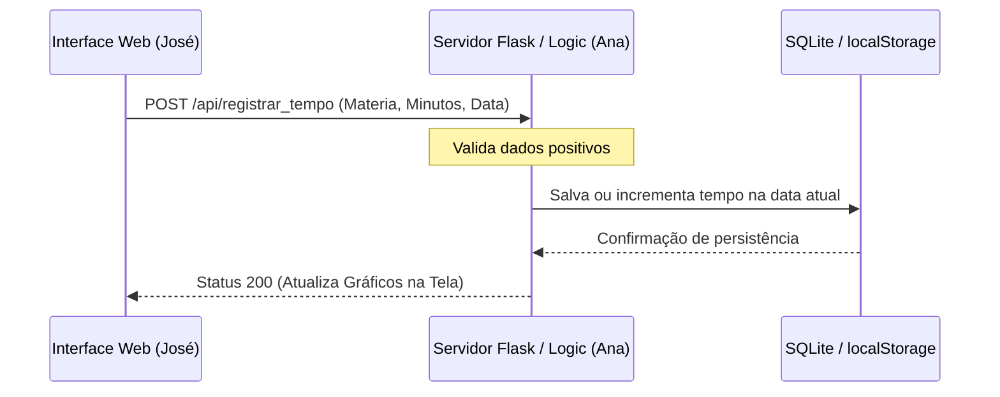

# 🗺️ 06-WIREFRAME_IDEAS.md: Arquitetura Visual e Esboços

## 📑 1. Objetivo da Arquitetura

Este documento serve como o "esqueleto" e guia visual para a implementação. Ele garante a aplicação da **Regra 80/20** (foco no registro rápido e exibição visual) e do princípio **Data-First**, onde a interface respeita rigorosamente o contrato do SCHEMA.md.

## 👥 2. Diagrama de Caso de Uso (DCU)

*Visão funcional de alto nível descrevendo o fluxo de uso do sistema.*

```mermaid
useCaseDiagram
    actor "Estudante (Eu)" as E
    
    package "Rastreador de Estudos" {
        usecase "Registrar Tempo Manual" as UC1
        usecase "Usar Cronômetro (Play/Pause)" as UC2
        usecase "Visualizar Gráfico do Dia" as UC3
        usecase "Persistir Dados Localmente" as UC4
    }
    
    E --> UC1
    E --> UC2
    E --> UC3
    UC1 ..> UC4 : <<include>>
    UC2 ..> UC4 : <<include>>
```

## 📱 3. Wireframe: Tela de Registro e Cronômetro (Foco Central)

*Foco: Registro ultra-rápido (< 5s) com design Glassmorphism focado em produtividade.*

**Estrutura Visual da Seção Superior:**
1. **Header:** Título do app (ex: "Foco Diário") com contador geral do dia em destaque (Total de Horas Hoje: X).
2. **Card Central (Glassmorphism):**
   - **Seletor:** Menu dropdown ou campo de texto para escolher/digitar a Materia.
   - **Bloco Cronômetro:** Contador visual (00:00:00) com botões grandes de Play/Pause.
   - **Input Alternativo:** Campo numérico para inserção manual rápida em minutos (Tempo_Gasto).
   - **Botão CTA:** "Salvar Sessão" (Cor sólida, alto contraste e bordas arredondadas).

## 🖥️ 4. Wireframe: Painel de Progresso Diário (Histórico)

*Foco: Alívio da ansiedade através da visualização imediata do progresso.*

**Estrutura Visual da Seção Inferior:**
1. **Dashboard Visual:** Gráfico de barras simples feito em CSS puro ou blocos proporcionais mostrando o tempo acumulado por matéria no dia corrente.
2. **Lista/Linha do Tempo Simples:**
   - Exibição das sessões salvas: *[Matéria] -> [X minutos dedicados hoje]*.
3. **Barra de Ação Local:** Botão discreto para limpar os dados se necessário (Reset).

## 🔄 5. Diagrama de Sequência (Fluxo de Dados)

*Detalhamento da interação entre a Interface (José) e a Lógica de Armazenamento (Ana).*



## 🎨 6. Mock Data e Estética (The Vibe)

Para validar a interface antes de rodar o backend final, o Agente José deve usar:
- **Paleta de Cores:** Fundo escuro com gradientes suaves e relaxantes (Soft Blues e Dark Grays) que ajudam no foco e evitam a fadiga ocular.
- **Comportamento:** Ao clicar em salvar, o cronômetro zera com uma animação sutil e a barra da matéria correspondente cresce visualmente de forma imediata.
- **Resiliência:** A interface deve carregar apenas ativos locais para garantir o funcionamento **Offline-First**.

### 🛂 Instrução para a IA
> *"José, use este wireframe como base inegociável para estruturar a tela única do index.html. Não adicione elementos complexos que gerem distrações visuais. Ana, certifique-se de que as rotas aceitem tanto o envio do cronômetro quanto o input manual de minutos, somando tudo corretamente conforme o Diagrama de Sequência."*
